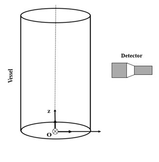
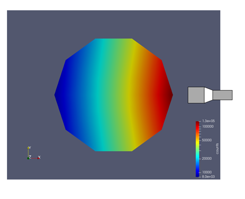
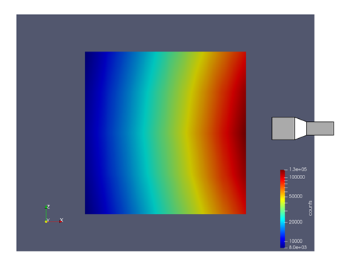

==================================
Photon Count calculation
==================================

In this example, photon counts calculation for a single radioactive particle that emits gamma-ray has been performed. We perform the calculations for a set of given positions inside a cylindrical tank using a Monte-Carlo technique. The Monte-Carlo calculation generates the estimated counts with respect to a detector for each particle’s position inside the vessel. The geometry of the vessel and the detector is illustrated below:

Parameter file
--------------

In the subsection “rpt parameters”, we define a set of positions inside the reactor, the export filename, the number of Monte-Carlo iterations, the seed number and parameters values for the gamma-ray model. Common parameters for the RPT simulation are described in the RPT parameters subsection in the RPT Parameters documentation.

.. code-block:: text

    # --------------------------------------------------
    # RPT Monte Carlo technique
    #---------------------------------------------------
     subsection rpt parameters
     set particle positions file          = positions.particle
     set verbosity                        = verbose
     set export counts                    = true
     set counts file                      = counts.csv
     set monte carlo iteration            = 100000
     set random number seed               = 0
     set reactor radius       		 = 0.1
     set peak-to-total ratio  		 = 0.4
     set sampling time        		 = 1
     set dead time       		 = 1e-5
     set activity  			 = 2e6
     set gamma-rays emitted        	 = 2
     set attenuation coefficient reactor  = 10
     set attenuation coefficient detector = 21.477
    end

In the subsection “detector parameters”, we specify the file that contains the position of the detector face center and the position of a point inside the detector on its axis. In this example, the detector face center position is [0.15, 0, 0.08] and [0.17, 0, 0.08] is another point on the detector’s axis. The detector parameters are described in the RPT Parameters documentation.

.. code-block:: text

   #---------------------------------------------------
   # Detector parameters
   #---------------------------------------------------
    set detector positions file          = positions.detector
    set radius       			 = 0.0381 
    set length                           = 0.0762
   end

Result
~~~~~~

The plots below visualize the received photon counts by the detector from different positions inside the cylinder. The algorithm of RPT works based on a precise phenomenological model which relates the spatial coordinate of the radioactive particle and the number of photon counts received by the detector. The following plots are the top view (x-y plane) and front view (x-z plane) of the vessel. As it is shown, if the particle is placed in an area closer to the detector, the detector senses a higher amount of gamma-rays intensity compared to the areas further from the detector’s face.

